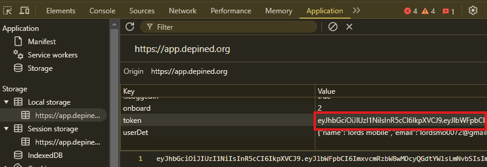

# Depined 机器人


## 功能

- **自动连接**
- **支持多账户**
- **支持使用代理**

## 前提条件

- 已安装Node.js
- `tokens.txt`文件包含depined平台的token，获取方法如下：
- 打开depined仪表盘 [https://app.depined.org/dashboard](https://app.depined.org/dashboard)
- 使用邮箱登录
- 按F12打开开发者工具，选择Application
- 在Local Storage中找到`token`并复制所有值
    

## 安装

1. 克隆仓库：
    ```sh
    git clone https://github.com/0xbaiwan/depined_bot
    cd depined_bot
    ```

2. 安装依赖：
    ```sh
    npm install
    ```
3. 在`tokens.txt`文件中输入你的token，每行一个用户：
    ```sh
    nano tokens.txt
    ```
4. 可选：使用代理：
- 在`proxy.txt`文件中粘贴代理，格式为`http://用户名:密码@ip:端口`
    ```sh
    nano proxy.txt
    ```
5. 运行脚本：
    ```sh
    npm run start
    ```

## 附加功能：自动注册/自动推荐
-   ```bash
    npm run autoreg
    ```
- 账户信息保存在`accounts.txt`，token自动保存到`tokens.txt`

## 购买代理（可选）

- 免费静态住宅代理：
   - [WebShare](https://www.webshare.io/?referral_code=gtw7lwqqelgu)
   - [ProxyScrape](https://proxyscrape.com/)
   - [MonoSans](https://github.com/monosans/proxy-list)
- 付费高级静态住宅代理：
   - [922proxy](https://www.922proxy.com/register?inviter_code=d6416857)
   - [Proxy-Cheap](https://app.proxy-cheap.com/r/Pd6sqg)
   - [Infatica](https://dashboard.infatica.io/aff.php?aff=580)
- 付费动态IP代理
   - [IPRoyal](https://iproyal.com/?r=733417)

